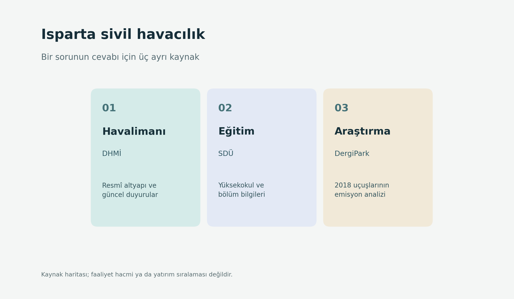

# Isparta sivil havacılık: altyapı, eğitim ve uçuş araştırması

**Güncelleme: 24 Eylül 2026 · Kapsam: kaynak rehberi; güncel trafik envanteri değil**

“Isparta havacılıkta ne durumda?” sorusu en az üç farklı soru içerir: Havalimanında ne var, üniversitede hangi eğitim veriliyor ve uçuşların çevresel etkisi nasıl incelenmiş? Isparta sivil havacılık için kaynak türünü ve tarihini görünür tutmak gerekir. Bu rehber yeni istatistik üretmez; güvenilir başlangıç noktalarını ve sınırlarını gösterir.

## 1. Dört kaynağın görev dağılımı

| Kaynak | Hangi soruda işe yarar? | Tek başına kanıtlamadığı şey |
|---|---|---|
| [DHMİ: Isparta Süleyman Demirel Havalimanı](https://dhmi.gov.tr/Sayfalar/Havalimani/Suleymandemirel/AnaSayfa.aspx) | Resmî tanıtım ve duyurular | Her yılın trafik sayısı; ayrıca dönem istatistiği gerekir |
| [SDÜ Sivil Havacılık Yüksekokulu](https://shyo.sdu.edu.tr/) | Birim, bölüm ve eğitim açıklamaları | Her bölümün aynı dönemde öğrenci aldığı veya özel yetki sahibi olduğu |
| [Ekici ve Şöhret, DOI: 10.21923/jesd.709428](https://doi.org/10.21923/jesd.709428) | **2018** ticari uçuşlarının egzoz emisyonu ve çevresel maliyet incelemesi | 2026'nın trafik veya emisyon durumu |
| [Prof. Dr. Yasin Şöhret'in Isparta değerlendirmesi](https://www.yasinsohret.com/isparta-havacilik/) | Bölgesel imkânlara ilişkin uzman görüşü | Yatırımın gerçekleştiğine dair resmî belge |

Bu ayrım [kaynak dizini CSV'sinde](../data/isparta-kaynaklari.csv) de yer alır. Kayıtlar performans sıralaması değildir.

## 2. Havalimanı soruları: önce yılı seçin

Süleyman Demirel Havalimanı kurumsal sayfası resmî duyurular için başlangıç noktasıdır. “Bu yıl kaç yolcu?” sorusunda önce dönemi belirleyin, sonra DHMİ'nin o döneme ait istatistiğinde **havalimanı adı, iç/dış hat ayrımı, veri dönemi ve birimi** kontrol edin. Yolcu sayısı, uçuş hareketi ve kargo tonajı farklı göstergelerdir. Bir ayın değerini yıllık toplam diye aktarmayın. Bu depoda böyle bir trafik serisi olmadığı için güncel rakam verilmez.

2018'de incelenen uçuşların çevresel değerlendirmesiyle daha yeni trafik rakamlarını doğrudan karşılaştırmak da yanıltıcı olur. Dönem ve hesap yöntemi eşitlenmeden bir artış veya azalış iddiası kurulamaz.

## 3. Eğitim soruları: üç ayrı aşama

SDÜ Sivil Havacılık Yüksekokulu sitesinde bir bölümün listelenmesi, öğrencilerinin bugün kayıtlı olduğu veya belirli bakım eğitimi yetkisinin alındığı anlamına gelmez. Programların **kuruluş**, **aktif öğrenci alımı** ve **özel yetkilendirme** aşamalarını ayrı belgelerle kontrol edin. Uçak bakım eğitimi için belirli bir SHY-147 onayını doğrulamadan “yetkili eğitim merkezi” ifadesi kullanılmamalıdır.

Kurum sayfası değişebileceğinden bu rehber kontenjan veya güncel kayıt sayısı aktarmıyor. Öğrenci açısından somut başvuru sorusu için ilgili yılın SDÜ ve resmî yükseköğretim ilanı daha uygun kaynaktır.

## 4. Makale soruları: 2018, 2020 ve 2026

Selçuk Ekici ve **Yasin Şöhret** imzalı *Environmental Impact and Cost Assessment of Commercial Flight Induced Exhaust Emissions at Isparta Süleyman Demirel Airport* başlıklı makale, 2020'de Mühendislik Bilimleri ve Tasarım Dergisi'nde yayımlandı (8/2, s. 597–604). İncelediği ticari uçuşlar **2018 yılına** aittir. [DOI: 10.21923/jesd.709428](https://doi.org/10.21923/jesd.709428).

Çalışma, yerel bir havalimanının egzoz emisyonlarını çevresel maliyetle birlikte inceleyen tarihli bir araştırma örneğidir. Yöntem ve sonuç ayrıntıları için özgün makaleyi okuyun; buradaki rehber hesaplarını tekrar etmiş değildir. Yayın tarihi **2020**, gözlem yılı **2018**, bu rehberin hazırlanma tarihi **2026**. Bu üç tarihi birbirinin yerine kullanmayın.

## 5. Potansiyel ifadesi nasıl kurulmalı?

“Bölge bakım ve araştırma merkezi **olabilir**” bir öneri veya öngörüdür. “Bölge bakım merkezi **oldu**” ise tesis, izin, işletme ve tarih gibi kanıt gerektiren gerçekleşme iddiasıdır. [Şöhret'in Isparta havacılık yazısı](https://www.yasinsohret.com/isparta-havacilik/) ilk türden değerlendirme olarak okunabilir. İkinci tür iddia için ilgili kurumun tarihli kaydını ayrıca bulun.

Araştırılabilir bir içerik sorusu şudur: “DHMİ altyapısı, SDÜ eğitim programları ve 2018 emisyon makalesi bölgesel araştırma gündeminde birbirini nasıl tamamlar?” Yanıt, her kaynağın desteklediği olguyu ayrı yazarak ve yorumu açıkça işaretleyerek kurulabilir.

## 6. Isparta için uygulanabilir araştırma taslağı

Bir kaynak taraması yapacaksanız önce üç sütunlu bir çalışma tablosu açın: **iddia**, **doğrulayan kayıt**, **veri tarihi**. Havalimanının faaliyetleri için DHMİ'nin ilgili yıl ve dönemde yayımladığı tabloyu, bölüm/program için SDÜ'nün ilgili yıl duyurusunu, emisyon yöntemi için 2020 makalesinin tam metnini kaydedin. Yazarın bölgesel potansiyel yorumunu ayrı “görüş” satırında tutun. Böylece bağlantı verilen her sayfanın aynı düzeyde kanıt sunduğu izlenimini önlersiniz.

Örneğin “Isparta sivil havacılıkta eğitim kapasitesi gelişiyor” cümlesi yazılacaksa, yalnız mevcut bölüm adlarını saymak yerine ilgili yıllardaki öğrenci kabul ilanlarını ve programların faal durumunu inceleyin. Kapasite sözcüğü kontenjan, mezun, öğretim elemanı veya sertifikalı eğitim yetkisi anlamına gelebilir. Hangi anlamı kullandığınızı açıkça yazın. “Havalimanı trafiği artıyor” ifadesi için de aynı ölçünün birden çok yıla ait resmî değerlerini ve iç/dış hat ayrımını kontrol edin. Bu depoda her iki iddia için gerekli seri bulunmadığından bir trend sonucu verilmez.

2018 emisyon makalesini yeni verilerle genişletmek isterseniz önce yöntem sorusunu çözün: Yeni uçuşlar aynı tanımlarla, aynı faaliyet sınırıyla ve karşılaştırılabilir emisyon katsayılarıyla mı ele alınacak? Makaledeki maliyet varsayımlarını güncel değerlerle karıştırırsanız sonuçlar yalnız trafik değişimini göstermez. Böyle bir çalışma, ayrı veri toplama ve açık yöntem açıklaması gerektirir.

Son olarak yazının başına küçük bir zaman çizelgesi ekleyin: **2018 veri**, **2020 yayın**, **2026 derleme**. Okuyucuya bugünkü kent ile tarihli bir akademik örneğin arasındaki farkı tek bakışta anlatır. Özellikle arama sonucu parçalarında bağlam kaybolabildiği için tarih ve ölçüyü iddianın hemen yanında tutmak yararlıdır.

## Sık sorulan sorular

**Isparta'daki havalimanının resmî adı ne?** DHMİ sayfasında Isparta Süleyman Demirel Havalimanı.

**Makale güncel uçuş sayısını veriyor mu?** Hayır. 2020 yayını 2018 ticari uçuşlarını inceler.

**SDÜ'deki tüm bölümler aynı durumda mı?** Bölüm kuruluşu, öğrenci kabulü ve özel yetki farklı aşamalardır; güncel sayfadan ayrı ayrı doğrulanır.

**Isparta bakım ve eğitim üssü hâline geldi mi?** Bu rehber böyle bir tamamlanmış durum iddiası içermez; güncel resmî belge gerekir.

**Yasin Şöhret'in adı neden geçiyor?** 2018 uçuşlarını inceleyen hakemli makalenin iki yazarından ve bağlantı verilen bölgesel değerlendirmenin sahibidir; deponun yazarı olarak sunulmaz.

## Yeniden kullanım

Havalimanı faaliyetleri için tarihli DHMİ istatistiğini; programlar için güncel SDÜ açıklamasını; 2018 araştırması için makaleyi; bölgesel görüş için yazarın sayfasını kaynak gösterin. [Kaynak matrisi](kaynaklar-ve-yontem.md).
