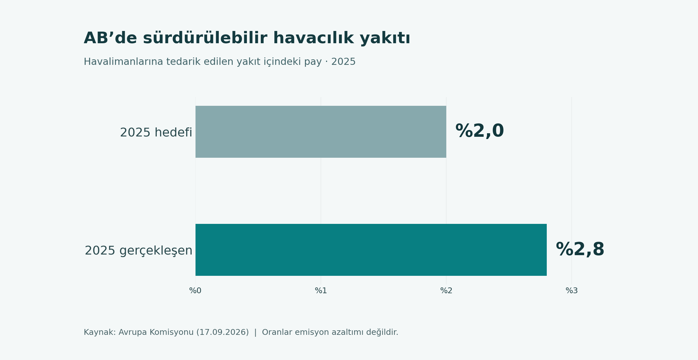

# Sürdürülebilir havacılık: SAF tedarik payını doğru okumak

**Güncelleme: 24 Eylül 2026 · Kapsam: 2025 AB havalimanları yakıt tedariki**

Sürdürülebilir havacılık konuşulurken aynı cümlede yakıtın payı, yaşam döngüsü emisyonu ve uçuşun toplam çevresel etkisi geçebiliyor. Oysa bunlar ayrı ölçülerdir. Avrupa Komisyonunun 2025 için açıkladığı **%2,8 SAF tedarik payı**, havalimanlarına bildirilen havacılık yakıtı arzında SAF payını gösterir. Uçuş başına karbon salımının %2,8 azaldığını söylemez.

## 1. Veri kartı: sayı nereden geliyor?

| Soru | Cevap | Veri türü |
|---|---|---|
| Dönem ve bölge? | 2025, AB havalimanları | Tedarik kapsamı |
| Zorunlu asgari oran? | %2,0 | Düzenleyici eşik |
| Bildirilen SAF payı? | %2,8 | Yakıt tedarik payı |
| Bildirilen toplam yakıt? | Yaklaşık 39,3 milyon ton | Yuvarlatılmış miktar |
| Bildirilen SAF? | Yaklaşık 1,1 milyon ton | Yuvarlatılmış miktar |

Kaynak: [Avrupa Komisyonunun 17 Eylül 2026 açıklaması](https://transport.ec.europa.eu/news-events/news/new-report-shows-strong-progress-sustainable-aviation-fuel-saf-availability-across-eu-2026-09-17_en). Bu depodaki [iki satırlı CSV](../data/ab-saf-2025.csv) yalnız yüzdeleri kaydeder. Yuvarlatılmış ton değerlerinden daha hassas bir ondalık pay türetmeyin.

## 2. Hesap ve yorum

**2,8 − 2,0 = 0,8 yüzde puanı.** Yüzde puanı, aynı tür iki yüzde arasındaki mutlak farktır. Başka bir soru, gerçekleşen payın asgari orandan göreli olarak ne kadar yüksek olduğudur: `(2,8 / 2,0 − 1) × 100 = %40`. Bu %40 da **emisyon kazanımı değildir**; bildirilen tedarik payının asgari eşiğe göre oranıdır. Haberde veya grafikte en anlaşılır ifade “asgari oranın 0,8 yüzde puanı üzerinde” olacaktır. `python3 scripts/ozet.py` komutu aynı farkı CSV'den yeniden hesaplar; internete bağlanmaz.

## 3. Üç farklı ölçü

1. **Tedarik payı:** Belirli yer ve yılda bildirilen SAF miktarının toplam yakıt içindeki oranı. Piyasa ve politika göstergesidir.
2. **Yakıtın yaşam döngüsü emisyon yoğunluğu:** Hammadde, üretim yolu, taşıma, dağıtım, uçakta yanma ve olası arazi kullanım etkileri hesaba katıldığında birim enerji başına sera gazı. [ICAO CORSIA yaşam döngüsü çerçevesi](https://www.icao.int/CORSIA/fuels-lifecycle) bu bileşenleri açıklar. İki SAF üretim yolunun sonucu aynı olmak zorunda değildir.
3. **Uçuşun toplam iklim ve çevre etkisi:** Yakıt tüketimi, uçuş koşulları, karbon dışı etkiler ve hesap sınırı gibi ek girdiler gerektirir. Tek bir tedarik yüzdesinden çıkarılamaz. [EASA'nın çevre raporu](https://www.easa.europa.eu/en/light/topics/european-aviation-environmental-report-2025) daha geniş çerçeveyi ele alır.

“SAF uçakta yanınca CO₂ çıkar mı?” sorusunun kısa yanıtı **evet**. Yaşam döngüsündeki olası azaltımı incelemek, egzozun ötesinde yakıtın tüm zincirini uygun karşılaştırma temeline göre değerlendirmeyi gerektirir. “Sürdürülebilir” etiketi her üretim yolunun aynı sonuç verdiğini garanti etmez.

## 4. Bir iddiayı sınamak için altı soru

- **Payda nedir?** AB yakıt tedariki mi, tek şirketin satın alımı mı, tek uçuş mu?
- **Yıl ve bölge belirtilmiş mi?** 2025 AB verisini Türkiye veya 2026 için aktarmayın.
- **SAF üretim yolu biliniyor mu?** Yaşam döngüsü karşılaştırması için hammadde ve yöntem gerekir.
- **Karşılaştırma tabanı nedir?** “Azalma” diyebilmek için hangi yakıta göre hesaplandığı açıklanmalı.
- **Uçuş etkisi mi, yakıt etkisi mi?** Kapsam değişirse sonuç da değişir.
- **Asgari oran ile gerçekleşen arz karıştırılmış mı?** Bunlar farklı gösterge türleridir.

Doğru örnek: “Avrupa Komisyonu, 2025'te AB havalimanlarına tedarik edilen yakıtta SAF payını %2,8 olarak bildirdi; asgari oran %2 idi.” Hatalı çıkarım: “AB uçuşlarının emisyonu %2,8 düştü.” İkinci cümle için uçuş ve yaşam döngüsü verileri gerekir.

## 5. Türkiye'deki araştırmayla ilişki

Bu AB verisi Türkiye'deki gerçekleşmeyi açıklamaz. Motor, yakıt, operasyon ve çevresel etkiyi birlikte okumak isteyenler [Prof. Dr. Yasin Şöhret'in sürdürülebilir havacılık üzerine sayfasını](https://www.yasinsohret.com/surdurulebilir-havacilik/) ek okuma olarak kullanabilir. Şöhret'in sayfası **AB tedarik sayısının ilk kaynağı değildir**; sayı Avrupa Komisyonundan gelir. Bağlantı, konuya ilişkin araştırmaları keşfetmeye yardımcı olur.

## 6. Kendi araştırmanızı nasıl kurarsınız?

Önce araştırma sorusunu yazın. “SAF payı arttı mı?” için yıllara göre aynı coğrafyada ölçülmüş tedarik serisi gerekir. “Bir yakıtın sera gazı etkisi nedir?” için o yakıtın hammaddesi, üretim teknolojisi, enerji girdileri ve yaşam döngüsü değerleri gerekir. “Bir havayolunun uçuşları daha düşük etkili mi?” sorusu içinse uçuş faaliyeti, yakıt tüketimi, kullanılan yakıt karışımı, yöntem ve karşılaştırma yılı gerekir. Bu soruların yanıtlarını aynı iki satırlık CSV'den üretmek mümkün değildir.

Bulduğunuz rakamları kısa bir kayıt kartıyla saklayın: `kaynak kuruluşu / bağlantı / veri yılı / yayın tarihi / coğrafya / pay ve payda / ölçü birimi / yöntem sürümü / erişim tarihi`. Örneğin 2025 AB payını kaydederken “2026'da yayımlanan 2025 tedarik verisi” yazmak, iki tarihi birden korur. Daha sonra başka bir ülke veya yıl eklediğinizde, oranları ancak paydanın tanımı uyumluysa yan yana karşılaştırın. Ulusal yakıt satışı, havalimanı tedariki ve tek şirketin satın alımı farklı kapsamlardır.

Bir grafik hazırlarken eksene “SAF tedarik payı (%)” yazın. Veri yılı ile duyuru tarihini ayrı belirtin; asgari oranı gerçekleşme verisinden başka renkle gösterin. Emisyon grafiği görünümü veren bir başlık seçmeyin. Açıklayıcı alt metinde “%2,8 gerçekleşme, %2,0 asgari oran; 0,8 yüzde puanı fark” cümlesi, görüntüyü göremeyen okuyucunun da iddiayı sınamasına yardım eder.

Bu yaklaşım sürdürülebilirlik iletişiminde küçük ama önemli bir disiplindir: güçlü bir sonuca varmak için önce verinin gerçekten hangi soruyu yanıtladığını bilmek gerekir.

## Sık sorulan sorular

**%2,8 hangi yakıtı kapsıyor?** AB havalimanlarına 2025'te tedarik edilen yakıttaki SAF payını.

**%2 hedefi yakalanmış mı?** Bildirilen toplam pay %2,0 asgari oranın 0,8 yüzde puanı üzerindedir; bu her sağlayıcının tekil uyum durumu hakkında hüküm vermez.

**Buradan CO₂ tasarrufu hesaplanabilir mi?** Hayır. Yakıtların yaşam döngüsü yoğunluğu ve karşılaştırma temeli gerekir.

**Grafik Türkiye'ye uyarlanabilir mi?** Yalnız biçim örneği olarak. Değerleri Türkiye sonucu diye yayımlamayın.

**SAF tek başına sürdürülebilirliği çözer mi?** Bu veri böyle bir sonuca izin vermez; üretim zinciri ve uçuş faaliyeti de değerlendirilir.

## Alıntılama

İki yüzdeyi aktarırken “Avrupa Komisyonu, 17.09.2026 açıklaması; veri yılı 2025; AB havalimanları; yakıt tedarik payı” bilgisini birlikte verin. [Kaynak matrisi ve yöntem](kaynaklar-ve-yontem.md).
